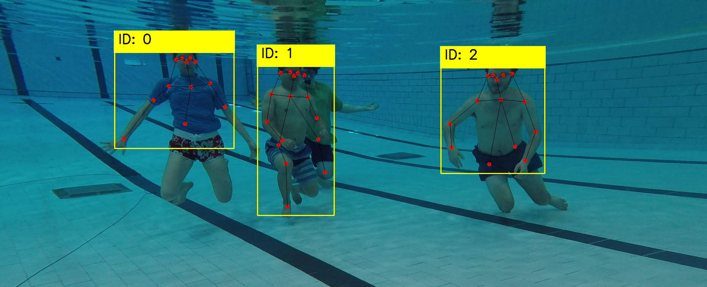
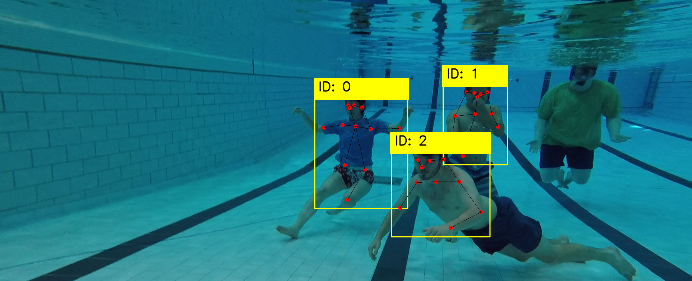

# Pose association 
- Implementations of **Pose Association** for person re-identification

### Usage
- Download the github repo **[tf_pose_estimation](https://github.com/xahidbuffon/tf-pose-estimation)** and obtain the pose keypoints txt file by running the github code
- Put the image file folder and the saved pose keypoints file folder to the **person-association** folder
- modify the OutPath, image_dir and the text_dir in the demo.py file according to the path where you want to save the results, where you put the image file folder and where you put the pose keypoints file.
- run python demo.py

### Results
 
### Acknowledgements
- https://github.com/huanghoujing/AlignedReID-Re-Production-Pytorch
- https://github.com/CMU-Perceptual-Computing-Lab/openpose
- https://github.com/huanghoujing/person-reid-triplet-loss-baseline
- https://github.com/KaiyangZhou/deep-person-reid
